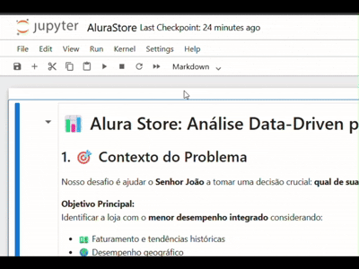
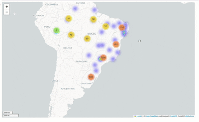

# Challenge - AluraStore: Data Analysis

    

## Ferramentas utilizadas

  
  
  
  
  
  

## 💻 Executar o projeto online

Você pode executar o notebook diretamente no navegador (sem instalar nada) clicando no botão abaixo:

👉 Clique no selo do Binder para abrir o projeto interativo:

> Depois que abrir, é só ir em: Run > Run All Cells

  

## 🎯 Objetivo:
Ajudar o Senhor João a decidir qual loja da sua rede Alura Store vender para iniciar um novo empreendimento. O objetivo é identificar a loja com menor eficiência e apresentar uma recomendação final baseada nos dados.

## 🔥 Desafios

- 🧠 **Storytelling:** Para mim, o principal desafio. Construir um fluxo narrativo que prenda a atenção e resalte todo o desenvolvimento da análise
- 🌍 **Análise Geográfica:** Um desafio muito gratificante. Impressionante o poder da biblioteca **Folium**, me apaixonei pelo geoprocessamento e quero estudar mais e particar mais dela também.

> 🎥 **Veja o mapa interativo em ação:**  

  

---

## 🔗 Projetos semelhantes

Já havia praticado Python, com Numpy e Matplotlib, para analisar dados experimentais. Como nesses repositórios abaixo:

- 🎛️ [DC-Motor](https://github.com/YannLeao/DC-Motor) – Análise da velocidade em função da corrente em um motor de corrente contínua
- 🍃 [Leaf-Electroscope](https://github.com/YannLeao/Leaf-Electroscope) – Estudo de comportamento eletrostático em um eletroscópio de folhas
